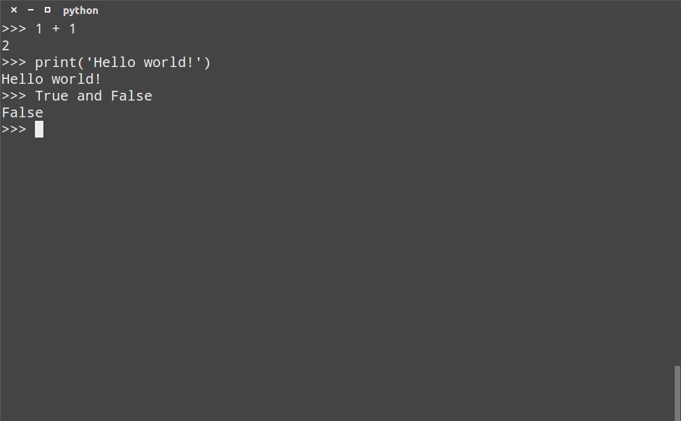
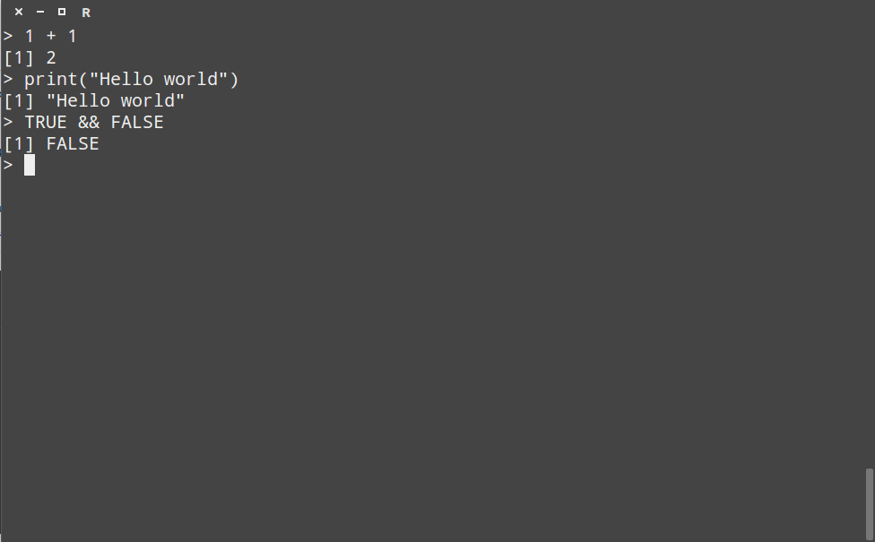
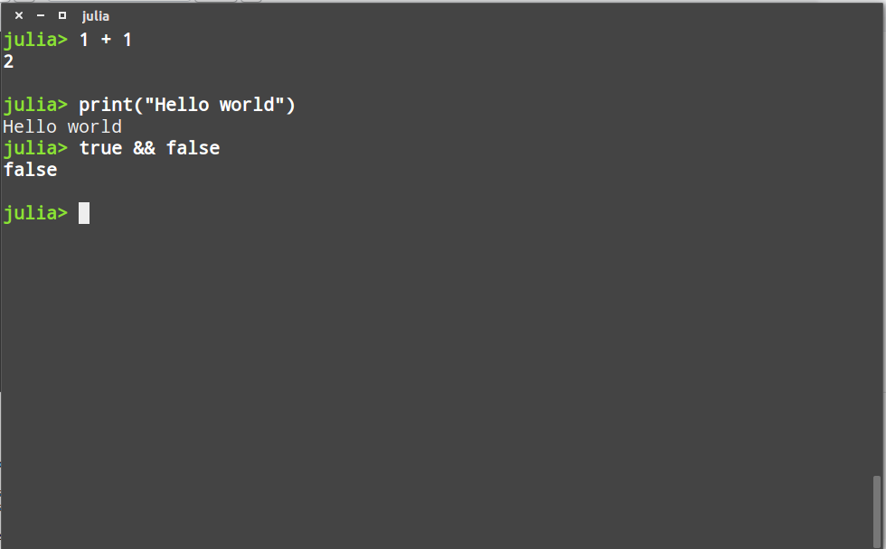
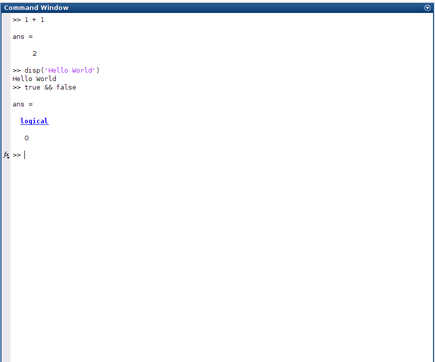

```{r setup, include=FALSE}
knitr::opts_chunk$set(echo = TRUE)
```

## Breve Introdução

Esse artigo tem por por objetivo mostrar os vícios e virtudes dos diferentes ecossistemas de desenvolvimeto no contexto de um fundo de investimentos quantitativo sistemático.

### Público Alvo

Escrevo essa avaliação tendo em mente um *Researcher* que passa boa parte do seu dia adquirindo, organizando, analizando, modelando, visualizando e comunicando um grande volume de dados de séries temporais sobre mercados, à semelhança da imagem abaixo:


Portanto, na minha análise focarei nessas atividades.

### Vieses

É importante deixar bem claro que eu **não sou** um juiz onisciente, justo e imparcial, e por isso acho importante deixar bem claras algumas coisas:

### Minha Experiência

Este que vos escreve já tem alguns anos de experiência em desenvolvimento de software, portanto conceitos como Orientação a Objetos, Classes, Compiladores, Paralelização etc não me são estranhos, o que não é verdade para boa parte do meu público alvo. Sendo assim, ainda que na minha análise eu tente utilizar a perspectiva de um usuário com menos experiência no desenvolvimento de software eu posso acabar falhando nessa mudança de perspectiva.

Além disso, tenho muito mais familiaridade com Python que com MatLab, ainda menos com R e quase nenhuma com o Julia, portanto boa parte do que escreverei aqui terá como fonte relatos anedóticos sorteados pelo Google.

### Meu Ecossistema Favorito

Vou deixar uma coisa muito clara: pra mim só deriam existir 3 linguagens de programação de paradigma funcional: C, Python e Javascript.

Obviamente essa é uma afirmação burra e preconceituosa, mas serve para evidenciar o meu viés ao longo desse artigo.

Me comprometo a, no melhor das minhas capacidades, suprimir ao máximo esse viés durante esse texto, mas ainda assim nada garante que serei feliz nessa tentativa.

## Ecossistemas de desenvolvimento

A essa altura alguns de vocês devem estar estranhando o fato de eu, até esse momento, ter utilizado a expressão *ecossistema de desenvolvimento* ao invés de *linguagem de programação* ou coisas similares, mas o uso dessa expressão é intencional.

A minha intepretação de ecossistema de desenvolvimento inclui não só as linguagens de programação em si, mas também todos os pacotes disponíveis, os ambientes de desenvolvimentos dessas linguagens, a comunidade que desenvolve a linguagem e que dá suporte[^1] à sua utilização, etc.

[^1]: Muitas vezes desenvolvedores optam por utilizar uma linguagem de programação defasada com uma boa comunidade de suporte que o caso contrário, vide a quantidade de perguntas sobre PHP no [Stack Overflow](https://stackoverflow.com/questions/tagged/php).

Abaixo estão descritos os ecossistemas básicos que eu utilizei nessa análise:

| Linguagem | Versão | IDE            | Pacotes/Distribuição |
|-----------|--------|----------------|----------------|
| Python    | 3.6.2  | [Sublime Text 3](https://www.sublimetext.com/) | [Anaconda 3.6](https://www.anaconda.com/downloads)   |
| MatLab    | R2016b Student Version| [MatLab](https://www.mathworks.com/products/matlab.html)         |                |
| R         | 3.2.3  | [RStudio](https://www.rstudio.com/products/rstudio/download/) | [Tidyverse](https://www.tidyverse.org/)      |
| Julia     | 0.4.5  | [Juno](http://junolab.org/) | [JuliaPro](https://juliacomputing.com/products/juliapro.html)       |


Todas os interpretadores, pacotes e IDE's estão disponíveis para os principais sistemas operacionais (Linux, MacOS e Windows). Ao longo desse texto utilizarei essas ferramentas na distribuição Ubuntu 16.04 LTS do Linux.

## Licenças

### Python

A linguagem de programação Python (códigos fonte e intepretador) utiliza uma [licença PSF](https://docs.python.org/3/license.html), que permite o uso privado e comercial irrestrito e não oferece nenhum tipo de garantias.

A distribiução Anaconda (cuja mantenedora é a empresa Continuum) [utiliza a cláusula 3 da licença BSD](https://docs.anaconda.com/anaconda/eula), que permite o uso irrestrito, pessoal e comercial de todos os códigos fontes e pacotes, desde que preservados os Copyrights.

O editor de texto Sublime Text permite a utilização pessoal sem a aquisição de licença, mas para uso comercial, até onde pude verificar, [é necessária a aquisição de uma licença Pessoal ou Comercial](https://www.sublimetext.com/sales_faq) que [custa USD 80.00](https://www.sublimetext.com/buy). Todavia o desenvolvimento em python pode ser feito através de qualquer editor de texto, desde o Notepad até IDE's mais poderosas como o [PyCharm](https://www.jetbrains.com/pycharm/). Aqui eu recomendo a utilização do Sublime Text por ser um editor de textos simples, leve, customizável e bastante poderoso *out of the box*.

### MatLab

O MatLab é um software proprietário da empresa [MathWorks](https://www.mathworks.com/), portanto tanto o interpretador quanto seus pacotes, para uso pessoal e comercial, possuem licenças pagas (atualmente uma licença comercial para uso individual [custa USD 2,560.00](https://www.mathworks.com/pricing-licensing.html)). Também existem licenças com descontos para estudantes, instituições de ensino e uso doméstico.

Uma alternativa à utilização do MatLab é o software gratuito e de código aberto [GNU Octave](https://www.gnu.org/software/octave/), cuja sintaxe e comportamento é quase um clone do MatLab ([lista com as diferenças entre MatLab e Octave](https://en.wikibooks.org/wiki/MATLAB_Programming/Differences_between_Octave_and_MATLAB). Todavia, como para qualquer software do projeto GNU não existe uma central de suporte ao usuário, mas [a comunidade que utiliza esse software pode ser de grande ajuda no caso](https://stackoverflow.com/questions/tagged/octave).

### R

O interpretador R utiliza principalmente as licenças [AGPL-2 e AGPL-3](https://www.r-project.org/Licenses/), que permite o uso irrestrito, pessoal e comercial de todos os códigos fontes e pacotes, desde que alterações no seu código fonte sejam publicados e utilizem a mesma licença.

As distribuições não Pro do RStudio também utilizam a licença [AGPL-3](https://www.rstudio.com/products/rstudio/).

### Julia

O intepretador Julia e a versão OpenSource da distribuição JuliaPro utiliza a licença [MIT](https://github.com/JuliaLang/julia/blob/master/LICENSE.md) que permite o uso irrestrito, pessoal e comercial de todos os códigos fontes e pacotes, desde que preservados os Copyrights.

A IDE Juno, que utiliza o editor de texto [Atom](https://atom.io/), utiliza uma [licença MIT levemente modificada](https://github.com/JunoLab/Juno.jl/blob/master/LICENSE.md).

## Workflow

No rol das ferramentas aqui analisadas, temos dois tipos de ferramentas:

* As linguagens de programação[^2] de propósito geral (Python)
* As linguagens de programação de propósito específico (MatLab, R e Julia)

[^2]: Estou utilizando os termos "Linguagem de Programação" e "Linguagem de Script" como equivalentes.

Ainda que tenham sida criadas em contextos e com propósitos diferentes, todas elas fornecem as mesmas formas de interação.

Abaixo eu lhes apresento as 3 principais formas.

### Modo interativo

Nesse modo o usuário se utiliza de um terminal para enviar comandos e obter os resultados destes. Todas as 4 linguagens oferecem suporte para esse modo:









### Modo script

Nesse modo o usuário escreve um script que será executado pelo interpretador. Todas as 4 linguagens oferecem suporte para esse modo:

#### Python

```python
#!/usr/bin/env python
# -*- coding: utf-8 -*-
# script.py

for _ in range(0, 10):
  print('Hello from inside a Python script!')

```

O [programa acima](examples/python/script.py) produz o seguinte resultado:

```shell
$ python script.py
Hello from inside a Python script!
Hello from inside a Python script!
Hello from inside a Python script!
Hello from inside a Python script!
Hello from inside a Python script!
Hello from inside a Python script!
Hello from inside a Python script!
Hello from inside a Python script!
Hello from inside a Python script!
Hello from inside a Python script!
```

#### R

```{r, eval=F}
# script.R

x <- 0
while(x < 10){
  print('Hello from inside a R script')
  x <- x + 1
}

```

O [programa acima](examples/r/script.R) produz o seguinte resultado:

```shell
$ Rscript script.R
[1] "Hello from inside a R script"
[1] "Hello from inside a R script"
[1] "Hello from inside a R script"
[1] "Hello from inside a R script"
[1] "Hello from inside a R script"
[1] "Hello from inside a R script"
[1] "Hello from inside a R script"
[1] "Hello from inside a R script"
[1] "Hello from inside a R script"
[1] "Hello from inside a R script"
```

#### Julia

```julia
# script.jl

i = 0

while i < 10
  println("Hello from inside a Julia script")
  i += 1
end

```

O [programa acima](examples/julia/scipt.jl) produz o seguinte resultado:

```shell
$ julia script.jl
Hello from inside a Julia script
Hello from inside a Julia script
Hello from inside a Julia script
Hello from inside a Julia script
Hello from inside a Julia script
Hello from inside a Julia script
Hello from inside a Julia script
Hello from inside a Julia script
Hello from inside a Julia script
Hello from inside a Julia script

```

#### Matlab

```matlab
% script.m

x = 0;

while x < 10
        disp('Hello from inside a MatLab script!')
        x += 1;
end

```

O [programa acima](examples/julia/scipt.jl) produz o seguinte resultado[^3]:

[^3]: Esse script foi executado no Octave para fins de conveniência mas o resultado seria o mesmo se executado no MatLab.

```shell
Hello from inside a MatLab script!
Hello from inside a MatLab script!
Hello from inside a MatLab script!
Hello from inside a MatLab script!
Hello from inside a MatLab script!
Hello from inside a MatLab script!
Hello from inside a MatLab script!
Hello from inside a MatLab script!
Hello from inside a MatLab script!
Hello from inside a MatLab script!
```

### Modo Notebook

Nesse modo o usuário redige um documento que contém texto (incluindo imagens, gráficos e animações) e código executável. Esse modo é (na minha opinião) o mais recomendado para pesquisadores pois permite um grande nível de documentação do código em uma forma que pode ser facilmente apreciada por leigos naquela linguagem.

#### Python

O projeto [IPython Notebook](https://ipython.org/), que agora foi expandido para o projeto [Jupyter](https://jupyter.org/)[^4], é um software que permite a edição e execução de Notebooks via Navegador.

[^4]: O Jupyter já vem instalado na distribuição Anaconda do Python.

A seguir um exemplo de utilização desse software:

**$1^o$ passo**: Executando o Jupyter Notebook:

```shell
$ jupyter notebook
[I 13:45:49.617 NotebookApp] Writing notebook server cookie secret to /run/user/1000/jupyter/notebook_cookie_secret
[I 13:45:49.646 NotebookApp] Serving notebooks from local directory: /home/luiz/projects/apresentacaoR/examples/matlab
[I 13:45:49.646 NotebookApp] 0 active kernels 
[I 13:45:49.646 NotebookApp] The Jupyter Notebook is running at: http://localhost:8888/?token=0072e15eb2dc57f5820907fca4b7e110df9ec9585d63f261
[I 13:45:49.646 NotebookApp] Use Control-C to stop this server and shut down all kernels (twice to skip confirmation).
[C 13:45:49.646 NotebookApp] 
    
    Copy/paste this URL into your browser when you connect for the first time,
    to login with a token:
        http://localhost:8888/?token=0072e15eb2dc57f5820907fca4b7e110df9ec9585d63f261
[I 13:45:49.966 NotebookApp] Accepting one-time-token-authenticated connection from 127.0.0.1
[23320:23357:1005/134550.001821:ERROR:browser_gpu_channel_host_factory.cc(103)] Failed to launch GPU process.
Foi criada uma nova janela em uma sessão existente do navegador.
```

Na maioria dos casos uma aba no seu navegador padrão se abrirá e será apresentada a interface Web do Jupyter:


**$2^o$ passo**: Abrindo o notebook:

